# Pipeline and Folder Map

Status: `COMPLETE`

- Repository: `C:/Users/donny/Desktop/futures_intraday_model_v2`
- Branch: `codex/tier1-phase8-economics`
- HEAD: `8bc3f1b3f3aea7d4742e2f33032307d83519571d`
- Verified at: `2026-08-07T14:29:34Z`
- Scope: static code and documentation inspection only
- Protected evidence: not opened or freshly hashed
- Mermaid rendering: manually inspected; no existing local checker was found,
  so rendering was not independently tested

This is a snapshot of folder topology and reachable code, not authorization to
run a phase. `Verified` means verified from the cited code or governing
document, not that payload bytes or research results were verified.

Classification vocabulary is literal. Implementation uses `SYNTHETIC_ONLY`,
`IMPLEMENTED`, `PREPARE_ONLY`, `BESPOKE_EVIDENCE_SCRIPT`,
`UNREACHABLE_MODULE`, `MISSING`, `RETIRED`, or `UNKNOWN`; authority is reported
separately. Claim status is exactly `Verified`, `Inferred`, `Assumed`, or
`Not established`. `RETIRED` applies to the historic command surfaces cataloged
by `docs/LEGACY_WORKFLOWS.md`; no retired surface is drawn as a current edge.
`BLOCKED_PROTECTED_READ` identifies claims this static audit deliberately could
not settle.

## Overview

```mermaid
flowchart TB
  subgraph intended["Intended workflow - PROJECT_OUTLINE.md"]
    I1A["1A DBN ingest<br/>data/dbn"] -->|CONCEPTUAL| I1B["1B raw conversion<br/>data/raw"]
    I1B -->|CONCEPTUAL| I2["2 causal foundation<br/>data/causally_gated_normalized"]
    I2 -->|CONCEPTUAL| I3["3 outcomes<br/>data/outcomes"]
    I2 -->|CONCEPTUAL| I4["4 features<br/>data/features"]
    I3 -->|CONCEPTUAL| I5["5 split plans<br/>manifests/split_plans"]
    I4 -->|CONCEPTUAL| I5
    I5 -->|CONCEPTUAL| I6["6 predictions<br/>data/predictions"]
    I6 -->|CONCEPTUAL| I7["7 prediction audit<br/>reports/phase7_prediction_audit"]
    I7 -->|CONCEPTUAL| I8["8 economics and risk<br/>reports/phase8_evaluation"]
    I8 -->|CONCEPTUAL| I9["9 robustness audit<br/>research-audit report path not established"]
    I9 -->|CONCEPTUAL| I10["10 candidate<br/>bundles"]
    I10 -->|CONCEPTUAL| I11["11 locked evaluation<br/>data/evaluations"]
  end

  subgraph current["Current implementation - reachable code"]
    CLI["Public futures-pipeline phase1a-11<br/>SYNTHETIC_ONLY<br/>configs/alpha_tiered.yaml"]
    F1A["1A layout and catalog support<br/>PREPARE_ONLY<br/>data/dbn + state/source_selection"]
    F1B2["1B and 2 foundation orchestrator<br/>IMPLEMENTED / unsafe preapproval access<br/>data/dbn -> data/raw -> causal"]
    AV["2 active-view publisher<br/>IMPLEMENTED / unsafe preapproval access<br/>data/active/causally_gated_normalized"]
    F34["3 and 4 Tier 1 builders<br/>IMPLEMENTED / unsafe preapproval access"]
    F5["5 split-plan builder<br/>IMPLEMENTED / unsafe preapproval access"]
    F6["6 WFA runner exposed by preparation script<br/>IMPLEMENTED / unsafe preapproval access"]
    F7["7 hard-coded audit<br/>BESPOKE_EVIDENCE_SCRIPT"]
    F8P["8 preparation and pinning<br/>PREPARE_ONLY / unsafe preapproval access"]
    F8R["8 evaluator and report writer<br/>UNREACHABLE_MODULE / convention-only token"]
    F9["9 current phase adapter<br/>MISSING"]
    F10["10 generic bundle library<br/>UNREACHABLE_MODULE"]
    F11["11 generic trial library<br/>UNREACHABLE_MODULE"]

    F1A -->|RESOLVES| F1B2
    F1B2 -->|PUBLISHES| AV
    AV -->|RESOLVES| F34
    F34 -->|PUBLISHES| F5
    F5 -->|RESOLVES| F6
    F6 -->|PUBLISHES| F7
    F7 -->|CONCEPTUAL| F8P
    F8P -->|CONCEPTUAL| F8R
    F8R -->|CONCEPTUAL| F9
    F9 -->|CONCEPTUAL| F10
    F10 -->|CONCEPTUAL| F11
  end

  controls["Cross-cutting controls<br/>configs | manifests | state | reports | authorization"]
```

The public phase CLI is a separate synthetic mechanics surface. It reads
`configs/alpha_tiered.yaml`, rejects `--real-history`, prints JSON, and writes
only an explicitly supplied `--output` path. The example workflow uses
`reports/pipeline_audit/*.json`; this is not a real-phase dispatcher.

| Synthetic overlay phase(s) | Implementation | Authority | Claim status | Operation | Path kind | Folder or path pattern | Evidence | Limitation |
| --- | --- | --- | --- | --- | --- | --- | --- | --- |
| `1A`, `1B`, `2`-`11` | SYNTHETIC_ONLY | NO_PROTECTED_ACCESS | Verified | READS | CONFIG | `configs/alpha_tiered.yaml` | `src/futures_rebuild/pipeline.py:main` | Every public phase subcommand runs the same complete synthetic pipeline, then selects one phase result. |
| `1A`, `1B`, `2`-`11` | SYNTHETIC_ONLY | NO_PROTECTED_ACCESS | Verified | WRITES | RUNTIME | Caller-supplied `--output`, if present | `src/futures_rebuild/pipeline.py:main` | Without `--output`, JSON is printed; the CLI does not publish a real phase artifact. |

## Phase and folder table

| Phase | Intended purpose | Implementation | Authority | Claim status | Operation | Path kind | Folder or path pattern | Owning code or command | Evidence | Limitation |
| --- | --- | --- | --- | --- | --- | --- | --- | --- | --- | --- |
| 1A | Ingest and verify DBN/sidecar pairs | PREPARE_ONLY | UNKNOWN_AUTHORITY_BOUNDARY | Verified | READS | CONFIG | `configs/source_contract.json`; `configs/data_layout_contract.json` | DBN catalog/layout support | `src/futures_rebuild/dbn_catalog.py:build_source_selection_manifest`; `src/futures_rebuild/phase1a_layout.py` | No current public provider-ingest dispatcher was established. |
| 1A | Ingest and verify DBN/sidecar pairs | PREPARE_ONLY | UNKNOWN_AUTHORITY_BOUNDARY | Verified | PUBLISHES | LOGICAL_RELEASE | `data/dbn/{family}/{market}/{year}/{filename}` | `PhasePublisher` layout support | `src/futures_rebuild/data_layout.py:LOGICAL_PATTERNS`; `src/futures_rebuild/phase1a_layout.py` | Layout/publication support is not provider acquisition authority. |
| 1A | Ingest and verify DBN/sidecar pairs | PREPARE_ONLY | UNKNOWN_AUTHORITY_BOUNDARY | Verified | PUBLISHES | MANIFEST | `manifests/data_releases/dbn/{release-id}.json` | `PhasePublisher` | `src/futures_rebuild/data_layout.py:MANIFEST_ROOT`; `src/futures_rebuild/phase1a_layout.py` | Manifest contents were not opened. |
| 1A | Select accepted DBN sources | UNREACHABLE_MODULE | UNKNOWN_AUTHORITY_BOUNDARY | Verified | WRITES | STATE | `state/source_selection/{name}.json` | DBN catalog module | `src/futures_rebuild/dbn_catalog.py:build_source_selection_manifest` | Module-level CLI exists, but it is not the public phase command or named in `CURRENT_WORKFLOW.md`. |
| 1A | Public phase command | SYNTHETIC_ONLY | NO_PROTECTED_ACCESS | Verified | READS | CONFIG | `configs/alpha_tiered.yaml` | `futures-pipeline phase1a` | `src/futures_rebuild/pipeline.py:main` | Executes the complete synthetic pipeline and selects the 1A result. |
| 1B | Resolve accepted source identities | IMPLEMENTED | UNSAFE_PREAPPROVAL_PROTECTED_ACCESS | Verified | READS | MANIFEST | Caller-supplied DBN, source-selection, and calendar-index manifests under `manifests/` | Foundation orchestrator CLI | `src/futures_rebuild/foundation/orchestrator.py:main` | The CLI opens protected manifests before minting its local operation receipt. |
| 1B | Convert accepted DBNs into immutable raw releases | IMPLEMENTED | UNSAFE_PREAPPROVAL_PROTECTED_ACCESS | Verified | READS | LOGICAL_RELEASE | `data/dbn/{family}/{market}/{year}/{filename}` | Foundation orchestrator/materializer | `src/futures_rebuild/foundation/orchestrator.py:main`; `src/futures_rebuild/foundation/materialize.py:materialize_raw_interval` | Real-row execution is reachable through `--execute`; the code does not require external authorization. |
| 1B | Convert accepted DBNs into immutable raw releases | IMPLEMENTED | UNSAFE_PREAPPROVAL_PROTECTED_ACCESS | Verified | READS | CONFIG | `configs/` source contract, feature spec, environment lock, and foundation policy files | Foundation orchestrator | `src/futures_rebuild/foundation/orchestrator.py:_CONFIG_FILES`; `src/futures_rebuild/foundation/orchestrator.py:main` | Exact configured values were not inspected for this map. |
| 1B | Convert accepted DBNs into immutable raw releases | IMPLEMENTED | UNSAFE_PREAPPROVAL_PROTECTED_ACCESS | Verified | PUBLISHES | LOGICAL_RELEASE | `data/raw/{market}/{year}/{interval}/{filename}` | Foundation materializer | `src/futures_rebuild/foundation/materialize.py:_logical_raw_root` | Release bytes were not inspected. |
| 1B | Publish raw release identity | IMPLEMENTED | UNSAFE_PREAPPROVAL_PROTECTED_ACCESS | Verified | PUBLISHES | MANIFEST | `manifests/data_releases/raw/{release-id}.json` | `PhasePublisher` | `src/futures_rebuild/foundation/materialize.py:materialize_raw_interval`; `src/futures_rebuild/data_layout.py:MANIFEST_ROOT` | Manifest contents were not opened. |
| 1B | Stage immutable publication | IMPLEMENTED | UNSAFE_PREAPPROVAL_PROTECTED_ACCESS | Verified | WRITES | STAGING | `state/data_publication_staging/{purpose}-{uuid}/` | `PhasePublisher` | `src/futures_rebuild/data_layout.py:STAGING_ROOT` | Runtime-only create/publish path. |
| 1B | Checkpoint foundation runs | IMPLEMENTED | UNSAFE_PREAPPROVAL_PROTECTED_ACCESS | Verified | WRITES | STATE | `state/foundation_runs_v2/{run-id}/checkpoint.json`; `state/locks/data-publication.lock` | Foundation orchestrator | `src/futures_rebuild/foundation/orchestrator.py:FoundationOrchestrator` | Internal local receipt is not external execution authority. |
| 2 | Build point-in-time causal data | IMPLEMENTED | UNSAFE_PREAPPROVAL_PROTECTED_ACCESS | Verified | READS | LOGICAL_RELEASE | `data/raw/{market}/{year}/{interval}/{filename}` | Foundation orchestrator/materializer | `src/futures_rebuild/foundation/materialize.py:materialize_causal_interval` | Protected rows were not opened in this task. |
| 2 | Build point-in-time causal data | IMPLEMENTED | UNSAFE_PREAPPROVAL_PROTECTED_ACCESS | Verified | READS | CONFIG | `configs/` foundation, calendar, economics, anomaly, feature, session, statistics, status, and resource policies | Foundation orchestrator | `src/futures_rebuild/foundation/orchestrator.py:_CONFIG_FILES` | The orchestrator hashes this closure during real execution without external authorization. |
| 2 | Build point-in-time causal data | IMPLEMENTED | UNSAFE_PREAPPROVAL_PROTECTED_ACCESS | Verified | PUBLISHES | LOGICAL_RELEASE | `data/causally_gated_normalized/{market}/{year}/{interval}/{filename}` | Foundation materializer | `src/futures_rebuild/foundation/materialize.py:materialize_causal_interval`; `src/futures_rebuild/data_layout.py:LOGICAL_PATTERNS` | Logical immutable release path. |
| 2 | Publish causal release identity | IMPLEMENTED | UNSAFE_PREAPPROVAL_PROTECTED_ACCESS | Verified | PUBLISHES | MANIFEST | `manifests/data_releases/causally_gated_normalized/{release-id}.json` plus dependent foundation release manifests | `PhasePublisher` and foundation orchestrator | `src/futures_rebuild/foundation/materialize.py:materialize_causal_interval`; `src/futures_rebuild/foundation/orchestrator.py:FoundationOrchestrator` | Manifest contents were not opened. |
| 2 | Stage active view | IMPLEMENTED | UNSAFE_PREAPPROVAL_PROTECTED_ACCESS | Verified | WRITES | STAGING | `state/active_data_view_staging/{plan-id}/`; `state/active_data_view_certification/` | Active-view materializer/certifier | `src/futures_rebuild/active_data_view.py:stage_view`; `src/futures_rebuild/active_data_view.py:main` | `materialize` loads its input package before calling `verify_approval`; certification verifies earlier, but the reachable surface is not fully guarded. |
| 2 | Publish and recover active view | IMPLEMENTED | UNSAFE_PREAPPROVAL_PROTECTED_ACCESS | Verified | WRITES | STATE | `state/active_data_view_publication/`; `state/active_data_view_rollback/`; `state/active_data_view_failed_publication/`; `state/locks/active_data_view.lock` | Active-view publisher | `src/futures_rebuild/active_data_view.py:main`; `src/futures_rebuild/active_data_view.py:verify_plan_bindings`; `src/futures_rebuild/active_data_view.py:publish_initial` | The worker verifies exact approval, but the CLI hashes all plan-bound files before entering that worker. |
| 2 | Expose current causal view | IMPLEMENTED | UNSAFE_PREAPPROVAL_PROTECTED_ACCESS | Verified | PUBLISHES | PHYSICAL_ACTIVE_VIEW | `data/active/causally_gated_normalized/{market}/{year}/{year}.parquet`, sidecar, and `data/active/catalog.json` | Active-view publisher | `src/futures_rebuild/active_data_view.py:main`; `src/futures_rebuild/active_data_view.py:publish_initial`; `src/futures_rebuild/active_data_view.py:publish_append_only`; `src/futures_rebuild/active_data_view.py:publish_full_successor` | Publication is approval-bound, but the current CLI performs preapproval binding hashes; it was not executed. |
| 2 | Resolve current causal view | IMPLEMENTED | UNSAFE_PREAPPROVAL_PROTECTED_ACCESS | Verified | RESOLVES | PHYSICAL_ACTIVE_VIEW | `data/active/causally_gated_normalized/{market}/{year}/{year}.parquet` and sidecar | Phase 3/4 active-input resolver | `src/futures_rebuild/active_phase3_input.py:load_active_phase3_input` | The downstream resolver reads/hashes protected input without its own authorization capability. |
| 3 | Build outcomes | IMPLEMENTED | UNSAFE_PREAPPROVAL_PROTECTED_ACCESS | Verified | READS | PHYSICAL_ACTIVE_VIEW | `data/active/causally_gated_normalized/{market}/{year}/{year}.parquet` and sidecar | Active Phase 3 builder | `scripts/run_tier1_core_foundation.py:run_pairs`; `src/futures_rebuild/active_phase3_input.py:load_active_phase3_input`; `src/futures_rebuild/active_phase3_outcomes.py:build_active_phase3_outcomes` | Reachable script path opens metadata/hashes or reads real input without an internal approval capability. |
| 3 | Build outcomes | IMPLEMENTED | UNSAFE_PREAPPROVAL_PROTECTED_ACCESS | Verified | WRITES | STAGING | `state/data_publication_staging/active_phase3_outcomes-{uuid}/` | Active Phase 3 builder | `src/futures_rebuild/active_phase3_outcomes.py:build_active_phase3_outcomes` | Create-only staging. |
| 3 | Build outcomes | IMPLEMENTED | UNSAFE_PREAPPROVAL_PROTECTED_ACCESS | Verified | PUBLISHES | LOGICAL_RELEASE | `data/outcomes/{label-method}/{market}/{year}/{year}/{release-id}/outcomes.parquet` | Active Phase 3 builder | `src/futures_rebuild/active_phase3_outcomes.py:build_active_phase3_outcomes` | Current Tier 1 label method is code-defined. |
| 3 | Publish outcome identity | IMPLEMENTED | UNSAFE_PREAPPROVAL_PROTECTED_ACCESS | Verified | PUBLISHES | MANIFEST | `manifests/data_releases/outcomes/{release-id}.json` | Active Phase 3 builder | `src/futures_rebuild/active_phase3_outcomes.py:build_active_phase3_outcomes` | Manifest contents were not opened. |
| 3 | Report outcome build | IMPLEMENTED | UNSAFE_PREAPPROVAL_PROTECTED_ACCESS | Verified | WRITES | REPORT | `reports/phase3_outcomes/tier1_core/{market}/{year}/{release-id}/report.json` | Active Phase 3 builder | `src/futures_rebuild/active_phase3_outcomes.py:build_active_phase3_outcomes` | Report contents were not opened. |
| 4 | Build causal features without outcome access | IMPLEMENTED | UNSAFE_PREAPPROVAL_PROTECTED_ACCESS | Verified | READS | PHYSICAL_ACTIVE_VIEW | `data/active/causally_gated_normalized/{market}/{year}/{year}.parquet` and sidecar | Active Phase 4 builder | `scripts/run_tier1_core_foundation.py:run_pairs`; `src/futures_rebuild/active_phase4_features.py:prepare_active_phase4_feature_binding` | Static code confirms the source; bytes were not opened here. |
| 4 | Bind feature input identity | IMPLEMENTED | UNSAFE_PREAPPROVAL_PROTECTED_ACCESS | Verified | READS | MANIFEST | `manifests/phase3_inputs/{input-id}.json` | Active Phase 4 builder | `src/futures_rebuild/active_phase4_features.py:_verify_input_record` | This is an input-record namespace, not the outcome release family. |
| 4 | Load feature specification | IMPLEMENTED | NO_PROTECTED_ACCESS | Verified | READS | CONFIG | `configs/mechanical_feature_spec.json` | Active Phase 4 builder | `src/futures_rebuild/active_phase4_features.py:_load_feature_spec` | Non-secret code/config topology. |
| 4 | Build causal features | IMPLEMENTED | UNSAFE_PREAPPROVAL_PROTECTED_ACCESS | Verified | PUBLISHES | LOGICAL_RELEASE | `data/features/{feature-method}/{market}/{year}/{year}/{release-id}/features.parquet` | Active Phase 4 builder | `src/futures_rebuild/active_phase4_features.py:build_active_phase4_features` | Current method ID is code-defined. |
| 4 | Publish feature identity | IMPLEMENTED | UNSAFE_PREAPPROVAL_PROTECTED_ACCESS | Verified | PUBLISHES | MANIFEST | `manifests/data_releases/features/{release-id}.json` | Active Phase 4 builder | `src/futures_rebuild/active_phase4_features.py:build_active_phase4_features` | Manifest contents were not opened. |
| 4 | Report feature build | IMPLEMENTED | UNSAFE_PREAPPROVAL_PROTECTED_ACCESS | Verified | WRITES | REPORT | `reports/phase4_features/tier1_core/{market}/{year}/{release-id}/report.json` | Active Phase 4 builder | `src/futures_rebuild/active_phase4_features.py:build_active_phase4_features` | Report contents were not opened. |
| 5 | Freeze nested chronological splits | IMPLEMENTED | UNSAFE_PREAPPROVAL_PROTECTED_ACCESS | Verified | READS | LOGICAL_RELEASE | `data/outcomes/{method}/{market}/{year}/{year}/{release-id}/outcomes.parquet`; `data/features/{method}/{market}/{year}/{year}/{release-id}/features.parquet` | Tier 1 split builder | `src/futures_rebuild/active_phase5_splits.py:_discover_pairs`; `scripts/run_tier1_phase5_split_plan.py` | Reads only identity, timing, session, and status columns, not feature values or outcome returns. |
| 5 | Resolve input release identities | IMPLEMENTED | UNSAFE_PREAPPROVAL_PROTECTED_ACCESS | Verified | READS | MANIFEST | `manifests/data_releases/outcomes/{release-id}.json`; `manifests/data_releases/features/{release-id}.json` | Tier 1 split builder | `src/futures_rebuild/active_phase5_splits.py:_discover_pairs` | Manifest contents were not opened in this task. |
| 5 | Freeze split plan | IMPLEMENTED | UNSAFE_PREAPPROVAL_PROTECTED_ACCESS | Verified | WRITES | MANIFEST | `manifests/split_plans/tier1_core/{plan-id}.json` | Tier 1 split builder | `src/futures_rebuild/active_phase5_splits.py:build_tier1_phase5_split_plan` | Create-only destination. |
| 5 | Report split plan | IMPLEMENTED | UNSAFE_PREAPPROVAL_PROTECTED_ACCESS | Verified | WRITES | REPORT | `reports/phase5_splits/tier1_core/{plan-id}/report.json` | Tier 1 split builder | `src/futures_rebuild/active_phase5_splits.py:build_tier1_phase5_split_plan` | No fitting, prediction, or economics evaluation in this phase. |
| 6 | Run WFA builders and save OOS predictions | IMPLEMENTED | UNSAFE_PREAPPROVAL_PROTECTED_ACCESS | Verified | READS | MANIFEST | `manifests/split_plans/tier1_core/{plan-id}.json` | Phase 6 script and builder | `src/futures_rebuild/active_phase6_wfa.py:prepare_tier1_phase6_binding`; `scripts/prepare_tier1_phase6_wfa.py:main` | Despite its name and prepare-by-default behavior, `--run` directly executes real fitting and prediction. |
| 6 | Fit and predict from frozen inputs | IMPLEMENTED | UNSAFE_PREAPPROVAL_PROTECTED_ACCESS | Verified | READS | LOGICAL_RELEASE | Phase 5-bound `data/outcomes/.../{release-id}/*.parquet`; `data/features/.../{release-id}/*.parquet` | Phase 6 WFA builder | `src/futures_rebuild/active_phase6_wfa.py:run_tier1_phase6_prediction_only_wfa` | Reads real outcome returns and feature values without an internal approval capability. |
| 6 | Register prediction-only trial | IMPLEMENTED | UNSAFE_PREAPPROVAL_PROTECTED_ACCESS | Verified | WRITES | STATE | `state/trial_registry/phase6_prediction_only/{trial-id}.json`; `state/trial_events/phase6_prediction_only/{trial-id}.json` | Phase 6 WFA builder | `src/futures_rebuild/active_phase6_wfa.py:run_tier1_phase6_prediction_only_wfa` | This custom state shape is distinct from generic `TrialRegistry` roots. |
| 6 | Build transient prediction output | IMPLEMENTED | UNSAFE_PREAPPROVAL_PROTECTED_ACCESS | Verified | WRITES | RUNTIME | `.pytest_tmp/workflow/{trial-id}/` | Phase 6 WFA builder | `src/futures_rebuild/active_phase6_wfa.py:run_tier1_phase6_prediction_only_wfa` | Despite the name, this is a runtime temporary location in production code. |
| 6 | Publish predictions | IMPLEMENTED | UNSAFE_PREAPPROVAL_PROTECTED_ACCESS | Verified | WRITES | LOGICAL_RELEASE | `data/predictions/tier1_phase6_conservative/{release-id}/predictions.parquet` | Phase 6 WFA builder | `src/futures_rebuild/active_phase6_wfa.py:run_tier1_phase6_prediction_only_wfa` | Shape differs from the generic `data_layout.py` prediction pattern. |
| 6 | Publish prediction identity and report | IMPLEMENTED | UNSAFE_PREAPPROVAL_PROTECTED_ACCESS | Verified | WRITES | MANIFEST | `manifests/data_releases/predictions/{release-id}.json` | Phase 6 WFA builder | `src/futures_rebuild/active_phase6_wfa.py:run_tier1_phase6_prediction_only_wfa` | Manifest contents were not opened. |
| 6 | Publish prediction identity and report | IMPLEMENTED | UNSAFE_PREAPPROVAL_PROTECTED_ACCESS | Verified | WRITES | REPORT | `reports/phase6_wfa/tier1_phase6_conservative/{release-id}/report.json` | Phase 6 WFA builder | `src/futures_rebuild/active_phase6_wfa.py:run_tier1_phase6_prediction_only_wfa` | Report contents were not opened. |
| 7 | Audit saved predictions | BESPOKE_EVIDENCE_SCRIPT | UNSAFE_PREAPPROVAL_PROTECTED_ACCESS | Verified | READS | LOGICAL_RELEASE | `data/predictions/tier1_phase6_conservative/{hard-coded-release-id}/predictions.parquet` | One-off Phase 7 script | `scripts/run_tier1_phase7_audit.py` | Hard-coded release ID, expected row count, fold set, and columns; not a general adapter. |
| 7 | Write prediction audit | BESPOKE_EVIDENCE_SCRIPT | UNSAFE_PREAPPROVAL_PROTECTED_ACCESS | Verified | WRITES | REPORT | `reports/phase7_prediction_audit/tier1_phase6_conservative/{release-id}/report.json` | One-off Phase 7 script | `scripts/run_tier1_phase7_audit.py` | Existing report contents and result status were not inspected. |
| 8 | Prepare economics and risk evaluation | PREPARE_ONLY | UNSAFE_PREAPPROVAL_PROTECTED_ACCESS | Verified | READS | STATE | `state/trial_registry/phase6_prediction_only/{trial-id}.json` | Phase 8 preparation | `src/futures_rebuild/tier1_phase8_readiness.py:audit_tier1_phase8_readiness`; `src/futures_rebuild/tier1_phase8_preparation.py:prepare_tier1_phase8` | Reads real-trial metadata before its confirmation object is produced. |
| 8 | Prepare economics and risk evaluation | PREPARE_ONLY | UNSAFE_PREAPPROVAL_PROTECTED_ACCESS | Verified | READS | MANIFEST | `manifests/data_releases/reference/{release-id}.json` | Phase 8 preparation | `src/futures_rebuild/tier1_phase8_readiness.py:audit_tier1_phase8_readiness`; `src/futures_rebuild/tier1_phase8_preparation.py:prepare_tier1_phase8` | The preparation seam opens reference manifests before it creates a confirmation object. |
| 8 | Pin real evaluation inputs | UNREACHABLE_MODULE | UNSAFE_PREAPPROVAL_PROTECTED_ACCESS | Verified | READS | MANIFEST | `manifests/data_releases/predictions/{release-id}.json`; `manifests/data_releases/features/{release-id}.json`; `manifests/data_releases/outcomes/{release-id}.json` | Phase 8 real adapter | `src/futures_rebuild/tier1_phase8_real_adapter.py:pin_phase8_prediction_release` | No current consumer reaches pinning; if called, it opens manifests and hashes payloads before any authority token. |
| 8 | Load evaluation policy | PREPARE_ONLY | NO_PROTECTED_ACCESS | Verified | READS | CONFIG | `configs/contract_economics_rules.json`; `configs/prop_firm_risk_profile.json`; Phase 8 evaluation config | Phase 8 preparation | `src/futures_rebuild/tier1_phase8_preparation.py:prepare_tier1_phase8`; `CURRENT_WORKFLOW.md` | Exact values were not evaluated. |
| 8 | Evaluate pinned predictions and economics | UNREACHABLE_MODULE | UNSAFE_PREAPPROVAL_PROTECTED_ACCESS | Verified | READS | LOGICAL_RELEASE | Phase 6 prediction, feature, and outcome Parquet bound by manifests | Internal Phase 8 runner | `src/futures_rebuild/tier1_phase8_real_adapter.py`; `src/futures_rebuild/tier1_phase8_runner.py:_evaluate_pinned_after_approval` | Row reads are opaque-token guarded, but pinning/hashing occurs earlier; no current public or workflow command reaches the runner. |
| 8 | Resolve execution source bars | UNREACHABLE_MODULE | UNSAFE_PREAPPROVAL_PROTECTED_ACCESS | Verified | READS | PHYSICAL_ACTIVE_VIEW | `data/active/causally_gated_normalized/{market}/{year}/{year}.parquet` and sidecar | Phase 8 real adapter | `src/futures_rebuild/tier1_phase8_real_adapter.py:_pin_source_bars` | Sidecar is parsed before the opaque row-read capability. |
| 8 | Write model-selection and risk reports | UNREACHABLE_MODULE | UNSAFE_PREAPPROVAL_PROTECTED_ACCESS | Verified | WRITES | REPORT | `reports/phase8_evaluation/{run-id}/model_selection.json`; `reports/phase8_evaluation/{run-id}/risk.json` | Internal Phase 8 runner | `src/futures_rebuild/tier1_phase8_runner.py:_publish_reports_after_approval`; `src/futures_rebuild/tier1_phase8_real_adapter.py:_approved_real_read_for_codex_task` | The token type is checked, but its factory accepts no authorization receipt and mints it unconditionally; no current command reaches the writer. |
| 8 | Generic evaluation publication layout | UNREACHABLE_MODULE | UNKNOWN_AUTHORITY_BOUNDARY | Verified | PUBLISHES | LOGICAL_RELEASE | `data/evaluations/{classification}/{trial-id}/{fold-id}/{filename}` | Generic data-layout contract | `src/futures_rebuild/data_layout.py:LOGICAL_PATTERNS` | Current Phase 8 runner writes reports, not this generic release family. |
| 9 | Run robustness, negative controls, and multiplicity | MISSING | UNKNOWN_AUTHORITY_BOUNDARY | Not established | WRITES | REPORT | Exact current research-audit report folder not established | No current Phase 9 adapter | `PROJECT_OUTLINE.md` Phase 9; reusable mechanics in `src/futures_rebuild/historical_capability.py` and `src/futures_rebuild/research/multiple_testing.py` | Reusable functions do not establish a current phase command or folder owner. |
| 10 | Seal candidate bundle | UNREACHABLE_MODULE | FULLY_GUARDED | Verified | READS | RUNTIME | Caller-supplied artifact path | Generic bundle library | `src/futures_rebuild/bundle.py:seal_bundle` | No current Phase 10 adapter or workflow command was established. |
| 10 | Seal candidate bundle | UNREACHABLE_MODULE | FULLY_GUARDED | Verified | WRITES | RUNTIME | `bundles/{bundle-id}/` | Generic bundle library | `src/futures_rebuild/bundle.py:seal_bundle` | Candidate path requires provenance and external readiness authorization. |
| 11 | Guard final holdout unlock | UNREACHABLE_MODULE | FULLY_GUARDED | Verified | WRITES | STATE | `state/trial_events/`; `state/trial_heads/head.json`; `state/locks/trial_events.lock` | Generic `TrialRegistry` | `src/futures_rebuild/trial.py:TrialRegistry.unlock_final_holdout` | No current Phase 11 adapter or workflow command was established. |
| 11 | Resolve exact sealed bundle | UNREACHABLE_MODULE | FULLY_GUARDED | Verified | READS | RUNTIME | `bundles/{bundle-id}/` | Generic bundle verifier | `src/futures_rebuild/bundle.py:verify_bundle` | Generic library only; no Phase 11 evaluator was established. |
| 11 | Publish guarded evaluation evidence | MISSING | UNKNOWN_AUTHORITY_BOUNDARY | Inferred | PUBLISHES | LOGICAL_RELEASE | `data/evaluations/{classification}/{trial-id}/{fold-id}/{filename}` | No current Phase 11 adapter | `PROJECT_OUTLINE.md` Phase 11; `src/futures_rebuild/data_layout.py:LOGICAL_PATTERNS` | Exact final-holdout classification/folder owner is not established without designing a new adapter. |

## Evidence basis

Each evidence input is identified below. `HEAD` means the inspected bytes match
the current commit. Per policy, only the modified, non-protected evidence file
was freshly hashed.

| Evidence file(s) | Basis | SHA-256 when required |
| --- | --- | --- |
| `AGENTS.md`; `CURRENT_WORKFLOW.md`; `PROJECT_OUTLINE.md`; `pyproject.toml` | HEAD | Not required |
| `src/futures_rebuild/pipeline.py`; `src/futures_rebuild/dbn_catalog.py`; `src/futures_rebuild/phase1a_layout.py`; `src/futures_rebuild/data_layout.py` | HEAD | Not required |
| `src/futures_rebuild/foundation/orchestrator.py`; `src/futures_rebuild/foundation/materialize.py` | HEAD | Not required |
| `src/futures_rebuild/active_data_view.py`; `src/futures_rebuild/active_phase3_input.py`; `src/futures_rebuild/active_phase3_outcomes.py`; `src/futures_rebuild/active_phase4_features.py`; `src/futures_rebuild/active_phase5_splits.py`; `src/futures_rebuild/active_phase6_wfa.py` | HEAD | Not required |
| `scripts/run_tier1_core_foundation.py`; `scripts/run_tier1_phase5_split_plan.py`; `scripts/prepare_tier1_phase6_wfa.py`; `scripts/run_tier1_phase7_audit.py` | HEAD | Not required |
| `src/futures_rebuild/tier1_phase8_preparation.py`; `src/futures_rebuild/tier1_phase8_readiness.py`; `src/futures_rebuild/tier1_phase8_real_adapter.py`; `src/futures_rebuild/tier1_phase8_runner.py` | HEAD | Not required |
| `src/futures_rebuild/historical_capability.py`; `src/futures_rebuild/research/multiple_testing.py`; `src/futures_rebuild/bundle.py`; `src/futures_rebuild/trial.py` | HEAD | Not required |
| `docs/LEGACY_WORKFLOWS.md` | WORKTREE_MODIFIED | `d921bc2f8bcbefacf1d3eb7dc7a29f8a2be4d395f71d37ebeaa36a0394ea8fd2` |

`docs/LEGACY_WORKFLOWS.md` was used only to confirm that historic workflow
material is not a current command surface.

No protected evidence file was used as a claim source. Directory or filename
presence, where mentioned, supports topology only.

## Limitations and blockers

- `BLOCKED_PROTECTED_READ`: actual manifest contents, payload integrity,
  observed result status, and report conclusions were deliberately not checked.
- Phase 6 is not honestly `PREPARE_ONLY`: its preparation-named script exposes
  `--run`, which directly fits on real values and publishes predictions without
  an internal approval capability.
- Active-view worker functions verify exact approval, but the current CLI is
  still unsafe: `materialize` opens its input package and `publish` hashes
  plan-bound files before the approval check inside the worker.
- Phase 8's opaque token is a convention, not an authority boundary: its
  factory accepts no authorization receipt and can mint the token directly.
- `Not established`: no current Phase 9 adapter or exact research-audit report
  folder was found within the bounded current-entrypoint search.
- `Not established`: no current Phase 10 or Phase 11 phase-specific adapter was
  found; generic bundle and trial libraries exist but are not public phase
  commands.
- Phase 1A layout/catalog support does not establish an active provider-ingest
  command or provider authority.
- The checkout is heavily dirty. Only the plan and this map were edited by this
  task; unrelated work was preserved.

## Mermaid/table reconciliation

- Every solid current-lane edge is represented by one or more table rows:
  1A resolves foundation inputs; foundation publishes the active view; the
  active view resolves into 3/4; 3/4 publish to 5; 5 resolves into 6; and 6
  publishes predictions consumed by 7.
- Conceptual edges from Phase 7 onward do not claim current execution.
- Primary folder families in the intended lane appear in the table or are
  explicitly marked `Not established`.
- The table is authoritative for complete folder detail; the Mermaid overview
  intentionally omits secondary manifests, reports, staging, and state paths.
